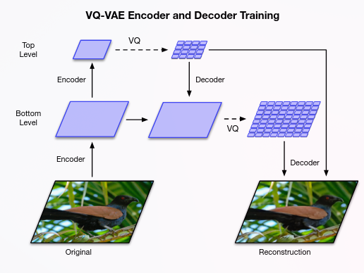
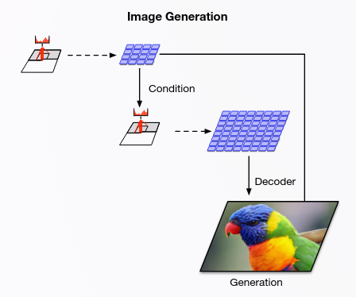

# Generatively Reproducing Hip-MRI Scans with VQ-VAE-2

This solution addresses project 10 in the project list

## Project Overview

This project implements a Vector Quantized Variational Auto Encoder (VQ-VAE-2) to generate high-quality synthetic Hip-MRI scans.
The goal is to create realistic synthetic MRI slices that reflect the anatomical structures and pathological variations found in prostate cancer.
The model is trained on 2D slices of prostate MRI scans.
Creating synthetic medical images can assist in data augmentation, improving model robustness, and preserving patient privacy in future models reducing the reliance on large clinical datasets.
The success of the model is evaluated using the Structural Similarity Index Measure (SSIM), with a score above 0.6 indicating good quality synthetic images.

## How it Works



This illustration shows the architecture of a hierarchical VQ-VAE-2 model during training. The input image is 256x256. The top level compresses the input to 64x64 and the bottom level further compresses it to 32x32. The decoder then reconstructs the image from the two latent spaces.



This diagram shows how the class label is fed into the two encoders during generation to construct a new image.

[Learn more about VQ-VAE-2 here](https://arxiv.org/pdf/1906.00446)

## Dependencies

Python **3.12** or higher is required. \
GPU with **CUDA** support is highly recommended for training the model. \
**Nibabel** is required for handling medical imaging data formats.

## Quick Install

### PIP

Install the required packages in a virtual environment from the `requirements.txt`:

```bash
python -m venv .venv
pip install -r hipmri-vqvae-s4802711/requirements.txt
```

This will install PyTorch, NumPy, Matplotlib, and other necessary libraries for installation.

### Conda

This command will install a basic conda environment with PyTorch, Cuda 12.1 and Python 3.12 and Nibabel:

```bash
conda create -n torch_env python=3.12 -y
conda activate torch_env
conda install pytorch torchvision torchaudio pytorch-cuda=12.1 nibabel -c pytorch -c nvidia -c conda-forge -y
```

## Results
