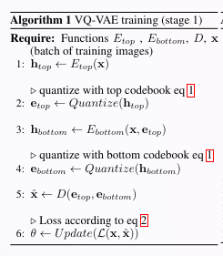
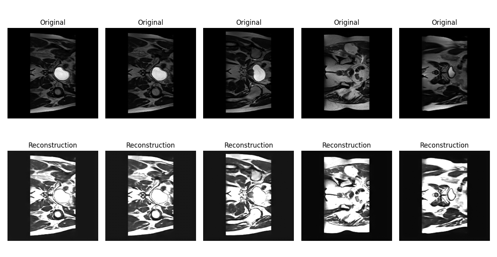

# Generatively Reproducing Hip-MRI Scans with VQ-VAE-2

This solution addresses project 10 in the project list

## Project Overview

This project implements a Vector Quantized Variational Auto Encoder (VQ-VAE-2) to generate high-quality synthetic Hip-MRI scans.
The goal is to create realistic synthetic MRI slices that reflect the anatomical structures and pathological variations found in prostate cancer.
The model is trained on 2D slices of prostate MRI scans.
Creating synthetic medical images can assist in data augmentation, improving model robustness, and preserving patient privacy in future models reducing the reliance on large clinical datasets.
The success of the model is evaluated using the Structural Similarity Index Measure (SSIM), with a score above 0.6 indicating good quality synthetic images.

## How it Works

The key difference between v2 and v1 is the hierarchy of vector quantized codes. This allows the model to model local information such as texture separately from the global structure. The training structure is illustrated below:


The model takes an input of 256x256. The top level compresses the input to 64x64 and the bottom level further compresses it to 32x32. The decoder is a forward feed-network that takes all the quantized latent layers as input and reconstructs the image back to its original size.

The following question shows the process of vector quantization:
$$\text{Quantize}(E(\mathbf{x})) = \mathbf{e}_k \text{, where } k = \underset{j}{\arg\min} \|E(\mathbf{x}) - \mathbf{e}_j\|$$

This process ensures a discrete, codebook-based representation, which is essential for the quality of the final images.



The implementation of the model can be found in `modules.py`


This diagram shows how the class label is fed into the two encoders during generation to construct a new image using the top and bottom decoders with a transformer prior.

The transformer prior is trained autoregressively to model the distribution of top-level latent codes. During generation:
1. A segmentation mask is provided as input conditioning
2. The transformer prior samples top-level discrete codes autoregressively 
3. The bottom-level codes are sampled randomly (or from a separate prior)
4. Both code levels are decoded through the VQ-VAE-2 decoder to generate the final image

The prior uses techniques like top-k filtering and nucleus sampling (top-p) to improve generation quality and diversity.

[Learn more about VQ-VAE-2 here](https://arxiv.org/pdf/1906.00446)

## Dependencies

Python **3.12** or higher is required. \
GPU with **CUDA** support is highly recommended for training the model. \
**Nibabel** is required for handling medical imaging data formats.

## Quick Install

### PIP

Install the required packages in a virtual environment from the `requirements.txt`:

```bash
python -m venv .venv
pip install -r hipmri-vqvae-s4802711/requirements.txt
```

This will install PyTorch, NumPy, Matplotlib, and other necessary libraries for installation.

### Conda

This command will install a basic conda environment with PyTorch, Cuda 12.1 and Python 3.12 and Nibabel:

```bash
conda create -n torch_env python=3.12 -y
conda activate torch_env
conda install pytorch torchvision torchaudio pytorch-cuda=12.1 nibabel -c pytorch -c nvidia -c conda-forge -y
```

## Dataset

This model is trained on the `keras_slices_data` dataset which you will need to provide. In the subfolder, the `keras_slices_train` and `keras_slices_test` are specifically needed for training and evaluating the model.

This can be found on Rangpur if you are a UQ student, or from [CSIRO](https://data.csiro.au/collection/csiro:51392v2?redirected=true)

## Usage

### Training the VQ-VAE-2

Running the training script:
in the 'hipmri-vqvae-s4802711' directory, execute:

```bash
python train.py --epochs 50 --batch_size 32 --learning_rate 0.0002 --filename vqvae_model.pth
```

### Training the Transformer Prior

After training the VQ-VAE-2, train the autoregressive transformer prior to learn the distribution of latent codes:

```bash
python train_prior.py --vqvae_path vqvae_model.pth --save_path transformer_prior.pth --epochs 20 --batch_size 16 --lr 3e-4
```

Optional flags:
- `--amp`: Enable automatic mixed precision for faster training
- `--compile`: Use torch.compile for additional speedup (requires PyTorch >= 2.0)

### Generation and Evaluation

Finally, use the prediction script to generate reconstructions and synthetic images:

```bash
python predict.py --vqvae_path vqvae_model.pth --prior_path transformer_prior.pth --num_images 5 --temperature 1.0 --top_k 50 --top_p 0.95
```

Generation parameters:
- `--temperature`: Controls randomness (higher = more diverse, lower = more conservative)
- `--top_k`: Only sample from top-k most likely tokens
- `--top_p`: Nucleus sampling threshold (sample from smallest set with cumulative prob >= top_p)

This will generate 5 synthetic images conditioned on segmentation masks and display both reconstructions and generated samples.

Additional command line arguments can be configured such as file name, and dataset path.

Use `--help` to see all options of a file.

## Results

I trained a model with the settings configured in `train.py` and 50 Epochs, a batch size of 32 and a learning rate of 0.0002. Doing this I was able to achieve a SSIM score of 0.9419 on the test set.

Here are 5 reconstructions of the original data:


Here are 5 synthetic images generated by sampling from the model:

